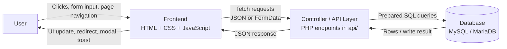
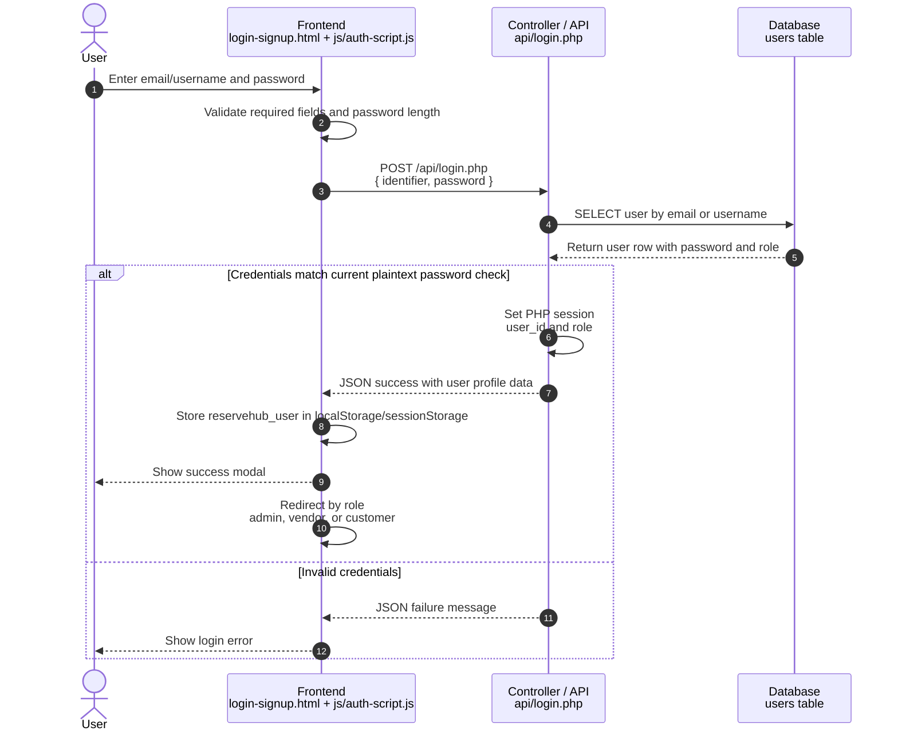
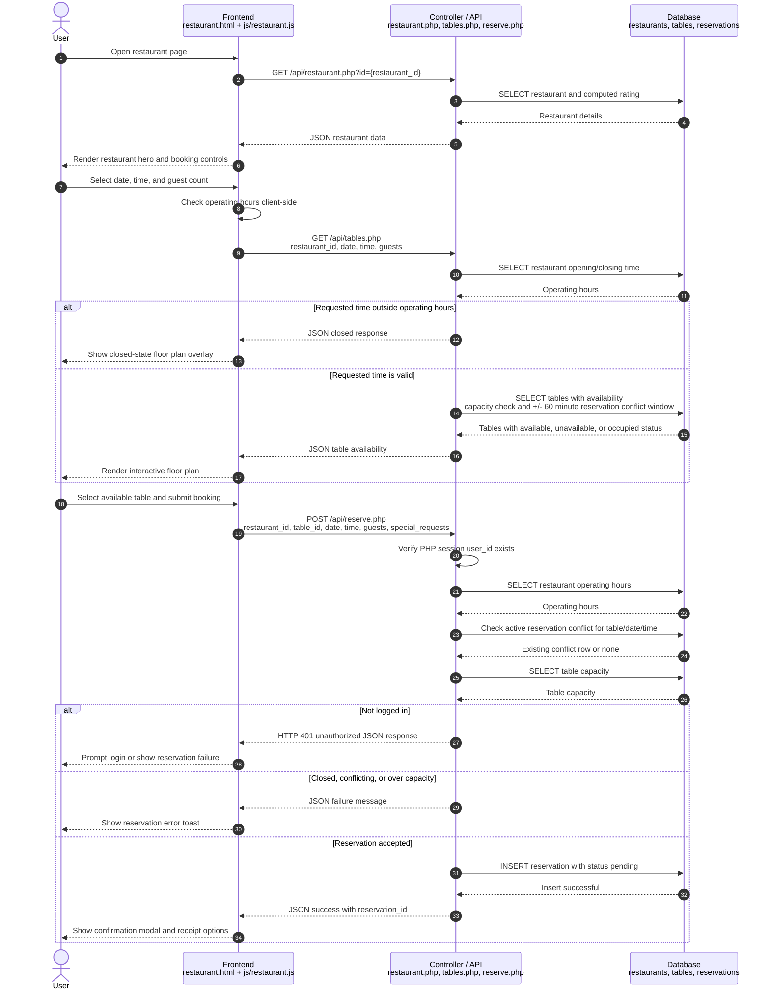

# System Design

> Written by Oleksandr Kotusenko (40318616)

This document illustrates the runtime interaction flow between ReserveHub's main components for core business operations.

## Component Interaction Model

ReserveHub is a PHP/MySQL web application with static HTML/CSS/JavaScript pages in the frontend and PHP JSON endpoints in the API layer. The browser stores a lightweight user object in `localStorage` or `sessionStorage` for UI state, while protected backend operations rely on the PHP session created by `api/login.php`.

## Authentication Flow

Current implementation:

- Frontend file: `js/auth-script.js`
- API endpoint: `api/login.php`
- Database table: `users`
- Session state: `$_SESSION['user_id']` and `$_SESSION['role']`
- Browser UI state: `reservehub_user` in `localStorage` or `sessionStorage`

Notes:

- The current code compares the submitted password directly with the stored value in `api/login.php`; no password hash is used yet.
- The browser-stored `reservehub_user` object controls navigation and UI rendering, but protected API access is authorized by the PHP session cookie.

## Reservation Process Flow

Current implementation:

- Frontend file: `js/restaurant.js`
- Restaurant details endpoint: `api/restaurant.php`
- Table availability endpoint: `api/tables.php`
- Reservation endpoint: `api/reserve.php`
- Database tables: `restaurants`, `tables`, `reservations`

Notes:

- Reservation availability is dynamic. The `tables` table does not store a static availability status; `api/tables.php` computes status from current reservation records.
- A reservation request is inserted with status `pending`. Vendors can later accept or cancel requests through `api/vendor_api.php?endpoint=update_reservation`.
- The backend repeats important validation from the frontend: operating hours, table conflict, and table capacity are checked again in `api/reserve.php`.
